# 🧭 Aristos — A Personal Coaching Framework

*A journaling and goal-tracking framework for [OpenClaw](https://github.com/openclaw) / [ZeroClaw](https://github.com/zeroclaw) and other Claw-type agents, and [n8n](https://n8n.io) automations. A method for AI agents to support the goals of their users.*

---

**Aristos is a framework, not software.** It's a structured set of prompts, templates, and conventions that teaches any compatible AI agent how to act as a personal coach — one that reads your journal, remembers your patterns, and actually gives a shit about where you're headed.

The agent persona is called **Aris**. Aristos is the framework that makes Aris possible: the journaling structure, the adaptive coaching logic, the memory schema, the outreach rules. Any AI agent that follows the Aristos conventions becomes Aris.

Aris lives inside your journal. It reads your notes, tracks your commitments, and meets you where you are — whether you're on a streak or struggling to start. It doesn't lecture. It doesn't guilt-trip. It shows up like a sharp friend who's been paying attention.

Grounded in structured journaling templates and adaptive coaching strategies from behavioral psychology, Aristos helps cut through overwhelm, build momentum from small wins, and stay connected to the things that actually matter. The framework tracks what works for each specific person — which strategies land, what time of day they're sharpest, when they need a push and when they need permission to rest — and adjusts over time.

This isn't a productivity dashboard. It's a companion that grows with you.

---

## ✨ Features

🧠 **Adaptive Coaching**
Four modes — returning, struggling, baseline, momentum — that shift based on your actual behavior, not your intentions.

🎯 **Strategy Rotation**
20+ coaching strategies drawn from ACT, behavioral psychology, and implementation science. Tracks what works for *you* and rotates accordingly.

📓 **Journal Integration**
Reads your daily, weekly, and yearly notes. Spots patterns you miss. Follows up on things you said you'd do.

💬 **Proactive Outreach**
Reaches out on its own — morning check-ins, evening reviews, casual pings — like a friend who texts first.

🔮 **Predictive Coaching**
Uses historical data to anticipate problems before they happen. Knows your risky days, your seasonal dips, your commitment patterns.

🫶 **Trauma-Aware**
Understands that resistance isn't laziness. Knows when to push and when to just be there. Never shames. Never lectures.

---

## 🚀 Quick start

1. 📥 Clone the repo
2. 📂 Keep the `Journal/` folder (shared across all platforms)
3. 🔧 Pick **ONE** of the `AI Instructions` folders:
  - `AI Instructions - n8n/` — for n8n workflow automation
  - `AI Instructions - ZeroClaw/` — for OpenClaw/ZeroClaw/Agent-0
4. 🗑️ Delete the other one
5. 📖 Follow the platform-specific setup below

---

## 📁 Folder structure

```
📂 Journal/
  📂 Templates/
    📄 Daily Focus Template.md       — copy to Day to Day/ as YYYY-MM-DD.md
    📄 Weekly Reflection Template.md — copy to Weekly reflection/ as YYYY-Www.md
    📄 Yearly Template.md            — copy to Yearly planning/ as YYYY.md
  📂 Day to Day/
    📄 2025-03-15.md                 — example daily note
  📂 Weekly reflection/
    📄 2025-W11.md                   — example weekly note
  📂 Yearly planning/
    📄 2025.md                       — example yearly plan

📂 AI Instructions - n8n/           ← pick one
📂 AI Instructions - ZeroClaw/      ← pick one
```

---

## 📓 The Journal — 2 minutes a day

The journal is the only thing you have to do. The AI handles everything else.

The templates are designed to be the **minimum viable input** — enough structure that an AI agent can reason about your life across three timescales (day, week, year), but short enough that you'll actually do it. A daily note takes about two minutes. A weekly reflection takes ten, once a week. The yearly note you fill in once.

That's it. The agent reads them, spots patterns you don't, and uses what it finds to coach you.

---

### 📄 Daily Focus Template — ~2 minutes

Three sections. That's the whole thing.

**Morning (~1 min):**

| Section | What you write | What the agent gets |
| --- | --- | --- |
| **Mission and priorities** | One sentence: "My mission today is to..." + 2–4 bullet priorities | What you're trying to do today. The agent checks whether this aligns with your weekly/yearly goals and whether you're overloading yourself. |
| **Time and metrics** | How many hours you have, the exact sequence of steps, what "done" looks like | Your capacity and your exit criteria. The agent uses this to assess whether your plan is realistic and to follow up on whether you hit it. |

**Evening (~1 min):**

| Section | What you write | What the agent gets |
| --- | --- | --- |
| **End of day review** | Gratitude, distractions, what you completed vs planned, mood/energy 1–10 | The execution gap (planned vs done), your mood trend, what's consistently getting in the way, and whether today needs a follow-up tomorrow. |

> The end-of-day review is the most important section. Even one sentence per prompt is enough. The mood/energy score alone — tracked over weeks — gives the agent a reliable signal for when to push and when to back off.

---

### 📄 Weekly Reflection Template — ~10 minutes, once a week

Two sections.

| Section | What you write | What the agent gets |
| --- | --- | --- |
| **End of week review** | Wins, distractions, emotional moments, energy patterns — end with 3–5 bullet summary | Weekly-level patterns: which days were hardest, what kept coming up, whether the week matched the plan. Used to update strategy rotation in `MEMORY.md`. |
| **Plans and adjustments** | Specific changes for next week: habits, time blocks, systems — end with 3–5 bullet summary | What you've decided to try differently. The agent tracks whether these adjustments actually land the following week. |

---

### 📄 Yearly Template — once (review quarterly)

Five sections covering your year mission, concrete milestones, reverse goal mapping, and a month-by-month breakdown across all four quarters.

The yearly note is the **anchor**. The agent reads it to keep day-to-day coaching connected to what you said actually mattered when you were thinking clearly about your life. It's what prevents the agent from helping you optimize tasks that shouldn't exist.

---

### Why this is enough

The templates are structured so every field is **parseable as a coaching signal**, not just freeform journaling. `JOURNAL_READING.md` teaches the agent exactly how to interpret each one:

- **Mission + priorities** → intention signal (what you thought mattered)
- **Time and metrics** → capacity signal (how much you had to work with)
- **Completions vs plan** → execution gap (how often your plans and reality diverge, and by how much)
- **Distractions** → interference pattern (what keeps recurring across weeks)
- **Mood/energy score** → baseline trend (your rhythms, your dips, your risky weeks)
- **Weekly summary bullets** → signal compression (the agent can read these without parsing the full entry)
- **Yearly milestones** → long-range anchor (prevents drift toward busywork)

Two minutes of structured writing per day gives the agent everything it needs to coach meaningfully — not because it's a lot of data, but because it's the *right* data.

---

### 📋 What's in each platform folder

🔧 **n8n** (8 files)


| File                    | Delivery                      | Purpose                                         |
| ----------------------- | ----------------------------- | ----------------------------------------------- |
| `SOUL.md`               | System prompt (every call)    | Personality, tone, emotional awareness          |
| `AGENTS.md`             | System prompt (every call)    | Core rules, adaptive mode, loading checklist    |
| `MEMORY.md`             | Read + write every session    | Live state — goals, commitments, mood, patterns |
| `STRATEGIES.md`         | Tool-read (coaching sessions) | Strategy menu by situation                      |
| `PREDICTIVE.md`         | Tool-read (coaching sessions) | Pattern prediction from historical data         |
| `PROACTIVE_OUTREACH.md` | Tool-read (outreach triggers) | When/how to reach out unprompted                |
| `MEMORY_SCHEMA.md`      | Tool-read (maintenance)       | Memory systems, archival rules                  |
| `JOURNAL_READING.md`    | Tool-read (coaching sessions) | How to parse journal entries                    |


🐾 **ZeroClaw** (9 files)


| File                    | Delivery                  | Purpose                                         |
| ----------------------- | ------------------------- | ----------------------------------------------- |
| `SOUL.md`               | Bootstrap (auto-loaded)   | Personality, tone, emotional awareness          |
| `AGENTS.md`             | Bootstrap (auto-loaded)   | Core rules, adaptive mode, loading checklist    |
| `MEMORY.md`             | Bootstrap (auto-loaded)   | Live state — goals, commitments, mood, patterns |
| `HEARTBEAT.md`          | Bootstrap (auto-loaded)   | Periodic outreach trigger checklist             |
| `STRATEGIES.md`         | Tool-read via `read_file` | Strategy menu by situation                      |
| `PREDICTIVE.md`         | Tool-read via `read_file` | Pattern prediction from historical data         |
| `PROACTIVE_OUTREACH.md` | Tool-read via `read_file` | When/how to reach out unprompted                |
| `MEMORY_SCHEMA.md`      | Tool-read via `read_file` | Memory systems, archival rules                  |
| `JOURNAL_READING.md`    | Tool-read via `read_file` | How to parse journal entries                    |


### 🔄 How file loading works

> **ZeroClaw:** Each file's YAML frontmatter tells ZeroClaw how to handle it:


| Frontmatter           | Meaning                                                                                      | Files                                                                                               |
| --------------------- | -------------------------------------------------------------------------------------------- | --------------------------------------------------------------------------------------------------- |
| `bootstrap: true`     | ⚡ Auto-injected into every session — always in context, agent never has to decide to load it | `SOUL.md`, `AGENTS.md`, `MEMORY.md`, `HEARTBEAT.md`                                                 |
| `delivery: tool-read` | 📖 Loaded on demand — the agent reads it via `read_file` only when needed, saving tokens     | `STRATEGIES.md`, `PREDICTIVE.md`, `PROACTIVE_OUTREACH.md`, `MEMORY_SCHEMA.md`, `JOURNAL_READING.md` |


Bootstrap files cost tokens on every call but guarantee the agent always has identity, rules, and current state. Tool-read files are only loaded when relevant (e.g., `STRATEGIES.md` during coaching, `PROACTIVE_OUTREACH.md` during outreach triggers).

> **n8n:** Doesn't use frontmatter — the workflow nodes explicitly control what gets loaded. `SOUL.md` + `AGENTS.md` + `MEMORY.md` are always read by the workflow and injected into the AI Agent node. Other files are available to the agent via Read File tool nodes and loaded on demand based on the checklist in `AGENTS.md`.

---

## 💰 Token load per invocation

The system is designed to minimize token cost by only loading what's needed.

📊 File sizes (n8n)


| File                    | Lines | Est. tokens | Loaded when                                  |
| ----------------------- | ----- | ----------- | -------------------------------------------- |
| `SOUL.md`               | ~40   | ~300        | Every call (system prompt)                   |
| `AGENTS.md`             | ~110  | ~900        | Every call (system prompt)                   |
| `MEMORY.md`             | ~100  | ~700        | Every call                                   |
| `STRATEGIES.md`         | ~260  | ~2,200      | Coaching sessions                            |
| `PREDICTIVE.md`         | ~70   | ~550        | Coaching sessions (skip for quick check-ins) |
| `PROACTIVE_OUTREACH.md` | ~280  | ~2,300      | Outreach triggers                            |
| `MEMORY_SCHEMA.md`      | ~200  | ~1,600      | Memory maintenance                           |
| `JOURNAL_READING.md`    | ~110  | ~800        | Coaching sessions                            |


📊 File sizes (ZeroClaw)


| File                    | Lines | Est. tokens | Loaded when                       |
| ----------------------- | ----- | ----------- | --------------------------------- |
| `SOUL.md`               | ~25   | ~200        | Every call (bootstrap)            |
| `AGENTS.md`             | ~90   | ~700        | Every call (bootstrap)            |
| `MEMORY.md`             | ~100  | ~700        | Every call (bootstrap)            |
| `HEARTBEAT.md`          | ~25   | ~200        | Every heartbeat cycle (bootstrap) |
| `STRATEGIES.md`         | ~150  | ~1,200      | Coaching sessions                 |
| `PREDICTIVE.md`         | ~55   | ~450        | Coaching sessions                 |
| `PROACTIVE_OUTREACH.md` | ~210  | ~1,700      | Outreach triggers                 |
| `MEMORY_SCHEMA.md`      | ~140  | ~1,100      | Memory maintenance                |
| `JOURNAL_READING.md`    | ~80   | ~650        | Coaching sessions                 |


### ⚡ What gets loaded when


| Invocation type       | Est. tokens (n8n)               | Est. tokens (ZeroClaw)        |
| --------------------- | ------------------------------- | ----------------------------- |
| Every call (minimum)  | ~1,900 (SOUL + AGENTS + MEMORY) | ~1,600 (bootstrap)            |
| Outreach trigger      | ~4,200                          | ~3,300 (bootstrap + outreach) |
| Coaching session      | ~5,800 + journal                | ~4,850 + journal              |
| Coaching + predictive | ~6,350 + journal                | ~5,300 + journal              |
| Memory maintenance    | ~3,500                          | ~2,700                        |


> 💡 A typical daily note adds ~150–350 tokens. Reading today + yesterday + weekly reflection adds ~500–1,000 on top.
>
> ⚠️ Keep `MEMORY.md` under 150 lines — it loads on every single call.

---

## 🔧 Setup: n8n

Use the `AI Instructions - n8n/` folder. Delete the other one.

> **How it works in 30 seconds:**
>
> 1. Place the vault on the same machine as n8n (or connect cloud storage)
> 2. Build a workflow that reads `SOUL.md` + `AGENTS.md` as the system prompt, and `MEMORY.md` as context — these load on **every** call
> 3. Add schedule triggers for outreach (morning, evening, weekly, random) — each one also loads `PROACTIVE_OUTREACH.md`
> 4. Give the AI Agent node Read/Write File tools so it can load `STRATEGIES.md`, `JOURNAL_READING.md`, and `PREDICTIVE.md` on demand during coaching sessions
> 5. After each run, write updated `MEMORY.md` back to disk and send the agent's message to the user via Telegram/Slack/Discord
>
> That's it. The workflow controls what loads when — the agent just coaches.

### 📂 Where to put the files

The n8n AI Agent node needs access to these files. You have two options:

**Option A: Local filesystem (recommended for self-hosted n8n)**

Place the entire repo folder on the same machine running n8n. Use Read/Write File nodes with absolute paths:

```
/path/to/vault/AI Instructions - n8n/SOUL.md
/path/to/vault/AI Instructions - n8n/AGENTS.md
/path/to/vault/AI Instructions - n8n/MEMORY.md
/path/to/vault/Journal/Day to Day/2025-03-15.md
```

If n8n runs in Docker, mount the vault as a volume:

```yaml
# docker-compose.yml (add to your n8n service)
volumes:
  - /path/to/vault:/vault
```

Then reference files as `/vault/AI Instructions - n8n/SOUL.md`, etc.

**Option B: Google Drive / cloud storage**

Store the vault in Google Drive, Dropbox, or similar. Use the corresponding n8n nodes (Google Drive node, etc.) to read and write files. This works well if n8n is cloud-hosted.

### 🔁 Workflow structure

```
Schedule Trigger → Code (random roll) → Read Files → AI Agent → Write MEMORY.md → Send Message
```

### ⚙️ Nodes

**1. Schedule Trigger**

Create separate trigger nodes for each outreach schedule:


| Trigger              | Cron          | Purpose                             |
| -------------------- | ------------- | ----------------------------------- |
| 🌅 Morning check-in  | `0 8 * `* *   | Say good morning / check daily note |
| ☀️ Midday casual     | `0 12 * * `*  | Casual check-in (50% random chance) |
| 🌙 Evening review    | `0 21 * * *`  | Check end-of-day review             |
| 📅 Wednesday drift   | `0 10 * * 3`  | Mid-week progress check             |
| 📝 Sunday reflection | `0 18 * * 0`  | Weekly reflection prompt            |
| ✅ Commitment scan    | `0 9 * * *`   | Follow up on open commitments       |
| 🎲 Random ping       | Interval (3h) | Pure social check-in (30% chance)   |


For the random/casual triggers, add a Code node after the Schedule Trigger that generates `Math.random()` and only continues if it's below the threshold.

**2. Read Files (Read File nodes or Code node)**

The workflow pre-loads files so the agent doesn't have to decide. Use Read File nodes to load:


| File                    | When to load             | Pass as                                    |
| ----------------------- | ------------------------ | ------------------------------------------ |
| `SOUL.md`               | Always                   | System prompt (concatenate with AGENTS.md) |
| `AGENTS.md`             | Always                   | System prompt (concatenate with SOUL.md)   |
| `MEMORY.md`             | Always                   | User message context                       |
| `PROACTIVE_OUTREACH.md` | Outreach triggers        | User message context                       |
| Today's daily note      | Always (check if exists) | User message context                       |
| Yesterday's daily note  | Always (check if exists) | User message context                       |


Use a Code node to concatenate `SOUL.md` + `AGENTS.md` into one string for the system prompt field.

**3. AI Agent node**

System prompt field: `{{ $json.soul + "\n\n" + $json.agents }}`

User message: construct based on the trigger type and file contents:

```
Trigger: morning_checkin
Current memory: [contents of MEMORY.md]
Today's note exists: [yes/no]
Yesterday's note: [contents or "none"]
Outreach rules: [contents of PROACTIVE_OUTREACH.md]

Determine if outreach is warranted. If yes, compose a message following the rules.
```

Give the agent file tools (Read/Write File) so it can load `STRATEGIES.md`, `PREDICTIVE.md`, and `JOURNAL_READING.md` on demand during coaching sessions — the loading checklist in `AGENTS.md` tells it when.

**4. Write MEMORY.md**

After the AI responds, use a Write File node to save the updated `MEMORY.md` back to the vault. The agent will include memory updates in its response if commitments, strategy log entries, or mood scores changed.

**5. Send Message**

Route to the user via Telegram, Slack, Discord, email, or any preferred channel.

### 🗺️ Example workflow: file loading logic

Below is what a complete n8n workflow looks like with the decision logic for which files to load. You'd build this as separate trigger branches that merge into a shared Code node.

```mermaid
flowchart TD
    T1[🌅 Schedule: morning 8am]
    T2[☀️ Schedule: midday 12pm]
    T3[🌙 Schedule: evening 9pm]
    T4[📅 Schedule: weekly Sun 6pm]
    T5[💬 Webhook: user chat message]

    T1 & T2 & T3 & T4 & T5 --> GATE["Code\nSet trigger type\nRoll random gate"]

    GATE -->|random gate failed| STOP([stop — skip this run])
    GATE -->|passed| LOAD["Read Files — always\nSOUL.md · AGENTS.md · MEMORY.md"]

    LOAD --> DETECT["Code\nDetect context type\nfrom trigger + message"]

    DETECT -->|outreach trigger| OUT[Outreach]
    DETECT -->|coaching session| COACH[Coaching]
    DETECT -->|casual chat| CHAT[Chat]

    OUT --> OUTFILES["Read File\nPROACTIVE_OUTREACH.md"]
    COACH --> COACHFILES["Read Files\nSTRATEGIES.md\nJOURNAL_READING.md\ntoday's note\nyesterday's note\nweekly reflection\n(optional: PREDICTIVE.md)"]

    OUTFILES & COACHFILES & CHAT --> BUILD["Code\nBuild system prompt: SOUL + AGENTS\nBuild user message: trigger + loaded files"]

    BUILD --> AGENT["🤖 AI Agent\n─────────────────\nSystem: SOUL + AGENTS\nMessage: trigger · memory · context\nTools: Read File · Write File · Vector DB"]

    AGENT --> WRITE[Write File\nMEMORY.md]
    WRITE --> SEND[Send Message\nTelegram · Slack · Discord]
```



> 🔑 **Key principle:** The workflow decides what to load, not the agent. Scheduled triggers always pre-load the outreach file. User-initiated messages pre-load coaching files. The agent only makes one decision on its own: "Should I also read `PREDICTIVE.md`?" — and `AGENTS.md` tells it when.

### 🗄️ Vector DB integration

Use a Qdrant, Pinecone, or Supabase vector store node:

- **Embedding:** When a daily/weekly note is completed, chunk it and embed with metadata tags
- **Retrieval:** Before the AI agent runs, query for relevant past entries and include in context

---

## 🐾 Setup: OpenClaw / ZeroClaw

Use the `AI Instructions - ZeroClaw/` folder. Delete the other one.

> **How it works in 30 seconds:**
>
> 1. Mount your vault into the ZeroClaw Docker container
> 2. ZeroClaw auto-loads 4 bootstrap files on every session: `SOUL.md` (personality), `AGENTS.md` (rules + adaptive mode), `MEMORY.md` (live state), and `HEARTBEAT.md` (outreach checklist)
> 3. The agent loads other files (`STRATEGIES.md`, `JOURNAL_READING.md`, `PREDICTIVE.md`) on demand via `read_file` — the checklist in `AGENTS.md` tells it when
> 4. Set up cron jobs for time-specific triggers (morning check-in, evening review, weekly reflection)
> 5. The heartbeat handles everything else — casual pings, commitment follow-ups, win celebrations
>
> No workflow builder needed. Drop the files in, configure the heartbeat, and the agent runs itself.

### ⚡ How bootstrap files work

ZeroClaw auto-loads files from the workspace into every session. The four bootstrap files (`SOUL.md`, `AGENTS.md`, `MEMORY.md`, `HEARTBEAT.md`) are injected automatically — the agent never has to decide to read them.

Other files (`STRATEGIES.md`, `PREDICTIVE.md`, etc.) are read on-demand via the `read_file` tool. The loading checklist in `AGENTS.md` tells the agent when to read each one.

### 🧠 Native memory + MEMORY.md

Claw-type agents have **native memory** — persistent conversation history across sessions. That handles the friendship layer: tone, inside jokes, personal context, what you talked about last time.

`MEMORY.md` adds structured coaching data on top: goals, commitments, strategy log, mood trends, and pattern tracking. Things that benefit from explicit structure rather than conversational recall.

### ⚙️ Configuration

**1. Mount the vault**

```yaml
# docker-compose.yml
services:
  agent:
    image: openclaw/zeroclaw:latest
    volumes:
      - /path/to/obsidian/vault:/vault
    environment:
      - WORKSPACE=/vault/AI Instructions - ZeroClaw
```

**2. 💓 Heartbeat (periodic outreach)**

`HEARTBEAT.md` runs every heartbeat cycle, checking outreach conditions in priority order. Configure in `openclaw.json`:

```json
{
  "agents": {
    "defaults": {
      "heartbeat": {
        "every": "30m",
        "activeHours": { "start": "08:00", "end": "22:00" }
      }
    }
  }
}
```

**3. ⏰ Cron jobs (time-specific triggers)**

Use `openclaw cron add` for triggers that must fire at exact times:

```bash
openclaw cron add --name "morning_checkin" --cron "0 8 * * *" --session isolated \
  --message "Trigger: morning_checkin. Read PROACTIVE_OUTREACH.md and follow the rules." \
  --announce --channel telegram

openclaw cron add --name "evening_review" --cron "0 21 * * *" --session isolated \
  --message "Trigger: evening_review. Read PROACTIVE_OUTREACH.md and follow the rules." \
  --announce --channel telegram

openclaw cron add --name "weekly_reflection" --cron "0 18 * * 0" --session isolated \
  --message "Trigger: weekly_reflection. Read PROACTIVE_OUTREACH.md and follow the rules." \
  --announce --channel telegram
```

The heartbeat handles frequent checks (commitments, wins, casual pings). Cron handles time-specific triggers.

**4. 🤖 Self-initiated outreach**

Claw-type agents can also reach out based on their own judgment during vault scans. If the agent notices a pattern, a win, or an anomaly, it can reach out without waiting for a scheduled trigger.

**5. 🛠️ Tool calls**


| Tool            | Purpose                            | Maps to                                  |
| --------------- | ---------------------------------- | ---------------------------------------- |
| `read_file`     | Read any file in the vault         | Instruction files, journal entries       |
| `write_file`    | Write to the vault                 | `MEMORY.md` updates, new journal entries |
| `list_files`    | Check what files exist             | Detect missing daily/weekly notes        |
| `vector_search` | Semantic search of past entries    | Pattern retrieval, success tracking      |
| `vector_embed`  | Store content for future retrieval | Daily notes, insights, archived memory   |


---

## 🏗️ Key design decisions

**Why split into platform folders?**

Each platform loads files differently. n8n pre-loads via workflow nodes, ZeroClaw auto-injects bootstrap files. Platform-specific folders let each version use the right file names, loading mechanisms, and scheduling patterns without compromises.

**Why merge adaptive mode into the system prompt?**

Adaptive mode (returning/struggling/baseline/momentum) affects every interaction — outreach tone, journal ask level, strategy pool. It's too important to risk the agent forgetting to load it. The ~500 token cost is worth paying on every call.

**Why split out predictive coaching?**

Predictive coaching (~550 tokens) queries the vector DB for historical patterns. It's valuable for full coaching sessions but unnecessary for quick check-ins or outreach pings. Keeping it separate saves tokens when it's not needed.

**Why a flat memory file instead of just the vector DB?**

The vector DB is great for retrieval by similarity but bad for structured current state. "What are the user's active commitments?" is a table lookup, not a semantic search. The flat file gives instant access to current state.

**Why 30-day archival?**

Without it, the memory file grows indefinitely. The 30-day cycle moves history to the vector DB (searchable but not always loaded) and keeps the working file small.

**Why log strategies?**

Without a strategy log, the AI repeats the same approach to the same pattern. The log enables rotation and tracks what actually works for this specific person.

---

**For people who are trying their best.**

---

<p align="center">
  <a href="https://star-history.com/#cityjohn/Aristos&Date" title="Star History">
    
  </a>
</p>

<p align="center">
  
</p>