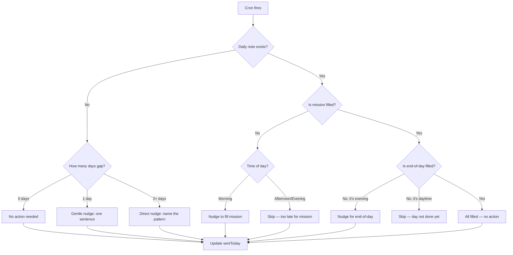

# Loop 1: Daily Pulse

## Purpose

Keep John engaged with his daily note schedule and detect gaps before they become patterns.

**The core problem this solves:** John knows he should write daily notes. He doesn't. The gap between intention and action grows. The Daily Pulse loop notices when he's slipping and nudges him — gently, not aggressively.

## Cadence

Every 3-4 hours during active hours (8 AM - 10 PM). 3-4 nudges per day maximum.

## Inputs

| Source | What it reads |
|---|---|
| `coaching-state.json` | signals.lastDailyNoteDate, signals.dailyNoteStreak, signals.lastEndOfDayFilled, coaching.sentToday |
| Daily note (today) | Does it exist? Is mission filled? Is end-of-day filled? |

## Decision Logic



## Output

One sentence coaching message sent to the main Telegram session. Examples:

| Situation | Message |
|---|---|
| No note today, morning | "No note yet today. What's the plan?" |
| No note for 2 days | "Two days without a note. What's going on?" |
| Mission filled, no end-of-day, evening | "How'd the day go? One sentence." |
| All filled | (no message) |

## Feedback

After sending, update `coaching-state.json`:
- Add to `sentToday` with strategy used
- Update `signals.lastDailyNoteDate` if a note was just written (detected on next run)

## Handoffs

| Trigger | Target Loop |
|---|---|
| 2+ day journal gap detected | Loop 4 (Pattern Detection) |
| End-of-day not filled for 5+ days | Loop 4 (Pattern Detection) |
| Streak reaches 7 days | Loop 6 (Weekly Synthesis) — celebrate |

## State Changes

```json
{
  "signals": {
    "lastDailyNoteDate": "updated if note exists",
    "dailyNoteStreak": "incremented if note exists today, reset if gap",
    "journalGapDays": "recalculated",
    "lastEndOfDayFilled": "updated if filled"
  },
  "coaching": {
    "sentToday": ["append {time, strategy, response: null}"]
  }
}
```

## Cron Job

Current: `morning-checkin`, `noon-followup`, `evening-coaching`, `evening-review`
Replace with: single `daily-pulse` job running 3x/day (8 AM, 1 PM, 7 PM)

## What this loop does NOT do

- Does not choose which coaching strategy to use (that's Loop 3)
- Does not detect avoidance patterns (that's Loop 4)
- Does not track goal progress (that's Loop 2)
- Does not search vault-memory (unnecessary for this loop)
