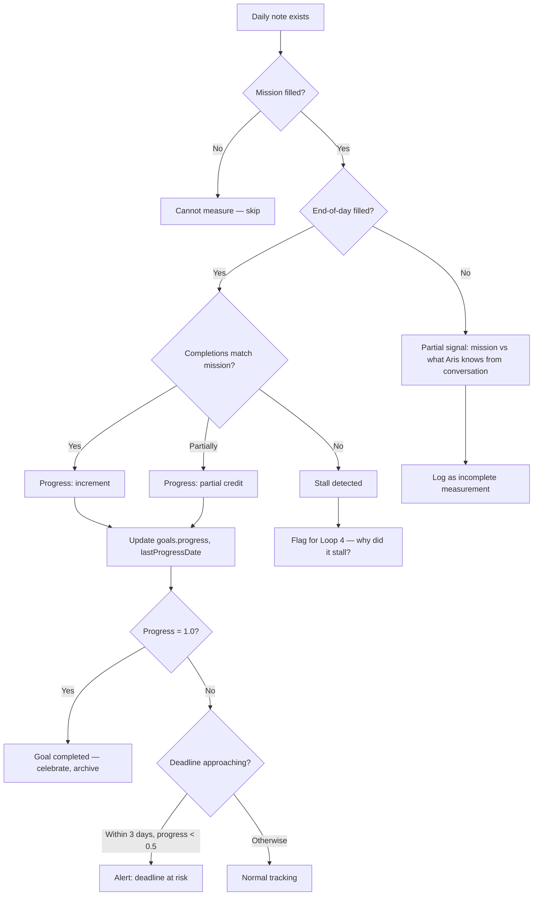

# Loop 2: Goal Churn

## Purpose

Track measurable progress toward John's active goals. Not motivation — measurement. Did he move the needle today?

**The core problem this solves:** John sets goals (Dominius, Tastrics, BCS exit) but doesn't track whether he's actually making progress. Days pass. Goals stall. He doesn't notice until the deadline hits.

## Cadence

Daily (evening, after end-of-day review) + weekly synthesis (Loop 6).

## Inputs

| Source | What it reads |
|---|---|
| `coaching-state.json` | goals array |
| Daily note (today) | Mission, priorities, completions, end-of-day review |
| Daily note (yesterday) | What was planned vs what happened |

## Decision Logic



## What "progress" means

Not subjective. Based on daily note evidence:

| Evidence | Progress assessment |
|---|---|
| "Completed layer 2" | +0.33 (of 3 layers) |
| "Worked on layer 2 but didn't finish" | +0.15 (partial) |
| "Planned to work on Dominius but didn't" | 0 (stall) |
| No mission mentioned | Can't measure |
| "Finished Dominius" | 1.0 (complete) |

Progress is updated by reading the daily note and mapping completions to the goal's milestones.

## Output

No message to John. Silent state update. The progress is used by other loops:
- Loop 3 uses it to choose motivational vs accountability strategies
- Loop 4 uses it to detect stalls
- Loop 6 uses it for weekly review

If a deadline is at risk, Loop 6 surfaces it in the weekly synthesis.

## Handoffs

| Trigger | Target Loop |
|---|---|
| Progress stalled for 3+ days | Loop 4 (Pattern Detection) |
| Deadline within 3 days, progress < 50% | Loop 6 (Weekly Synthesis) — escalate |
| Goal completed | Loop 6 (Weekly Synthesis) — celebrate, set new goal |

## State Changes

```json
{
  "goals": [{
    "progress": "updated based on daily note completions",
    "lastProgressDate": "updated if progress made",
    "status": "completed / blocked / active",
    "difficulty": "updated based on end-of-day notes"
  }]
}
```

## How difficulty is tracked

From the daily note's end-of-day review:
- "That was hard" / "Struggled with" → difficulty: high
- "Went smoothly" / "Easy win" → difficulty: low
- No mention → keep previous value

Difficulty informs Loop 3's strategy selection: high difficulty → compassion strategies. Low difficulty → accountability strategies.

## What this loop does NOT do

- Does not motivate John (that's Loop 3)
- Does not detect avoidance patterns (that's Loop 4)
- Does not send messages (that's Loop 1)
- Does not make coaching decisions (that's Loop 3)
