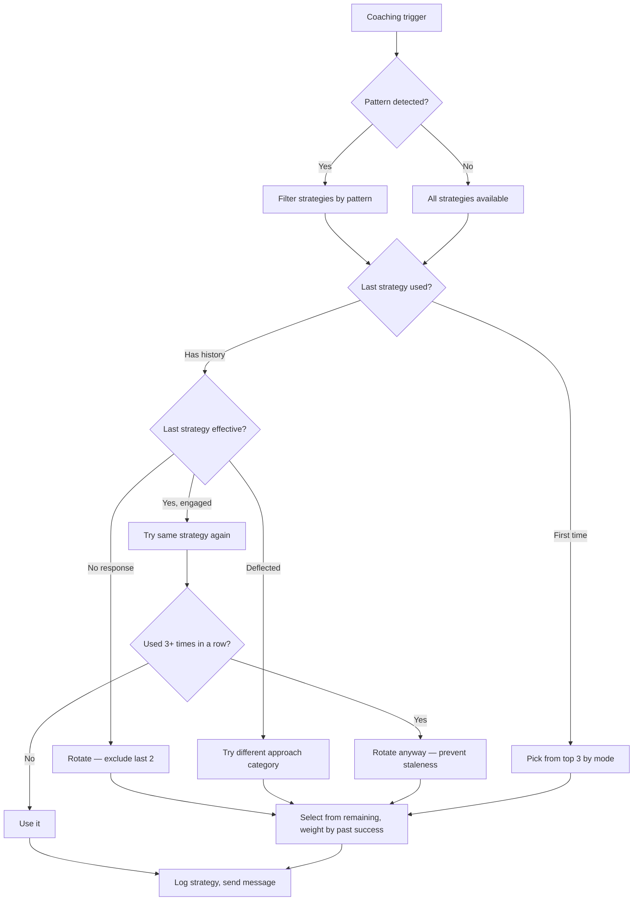

# Loop 3: Strategy Rotation

## Purpose

Learn which coaching strategies work for John specifically and rotate accordingly. Not generic motivational advice — personalized coaching that adapts.

**The core problem this solves:** Without outcome tracking, the agent repeats the same ineffective approaches. "Implementation intentions" might work for some people but fail for John. Loop 3 discovers this through data and stops using it.

## Cadence

Triggered per coaching interaction — every time Loop 1 sends a message, Loop 3 decides which strategy to use.

## Inputs

| Source | What it reads |
|---|---|
| `coaching-state.json` | coaching.strategyHistory, coaching.currentStrategy, patterns.active |
| `coaching-state.json` | signals (mood, energy, journal gap, streak) |
| `coaching-state.json` | goals (difficulty, progress, deadline proximity) |
| `STRATEGIES.md` | Available strategies with descriptions |

## Decision Logic



## Strategy categories

Strategies fall into categories. Never use the same category twice in a row:

| Category | Strategies | When to use |
|---|---|---|
| **Compassion** | self-compassion, presence, validation | High difficulty, burnout, emotional weight |
| **Accountability** | implementation-intentions, commitment-check, specific-plan | Low difficulty, clear tasks, deadline pressure |
| **Reframe** | perspective-shift, humor-redirect, socratic-questioning | Stuck thinking, negative spiral |
| **Momentum** | small-wins, micro-step, celebrate-progress | Low energy, just need to start |
| **Challenge** | direct-ask, pattern-naming, reality-check | Avoidance is clear, John is capable but avoiding |

## Outcome tracking

After each coaching message, wait 24 hours and check:

| Outcome | Definition |
|---|---|
| `engaged` | John responded and engaged with the topic |
| `no-response` | John didn't respond within 24 hours |
| `deflected` | John responded but changed the subject |
| `action` | John took the suggested action within 24 hours |

Log in `coaching-state.json`:
```json
{
  "strategy": "implementation-intentions",
  "date": "2026-03-31",
  "context": "avoidance",
  "response": "engaged",
  "effective": true
}
```

## Effectiveness scoring

Rolling 20-interaction window:

| Score | Meaning |
|---|---|
| 0/5 uses effective | **Ban** — stop using this strategy for 2 weeks |
| 1-2/5 | **Avoid** — only use if nothing else fits |
| 3/5 | **Neutral** — use when appropriate |
| 4-5/5 | **Favor** — prioritize this strategy |

## Output

Selected strategy name + coaching message. Passed to Loop 1 for delivery.

## Handoffs

| Trigger | Target Loop |
|---|---|
| All strategies scoring low | Loop 5 (Knowledge Application) — find new approaches |
| Pattern-specific strategies needed | Loop 4 (Pattern Detection) provides context |
| Weekly strategy review | Loop 6 (Weekly Synthesis) |

## State Changes

```json
{
  "coaching": {
    "currentStrategy": "selected strategy name",
    "lastStrategy": "previous currentStrategy",
    "strategyHistory": "append outcome after 24h observation"
  }
}
```

## What this loop does NOT do

- Does not send messages (that's Loop 1)
- Does not measure goal progress (that's Loop 2)
- Does not detect patterns (that's Loop 4)
- Does not search knowledge base (that's Loop 5)
