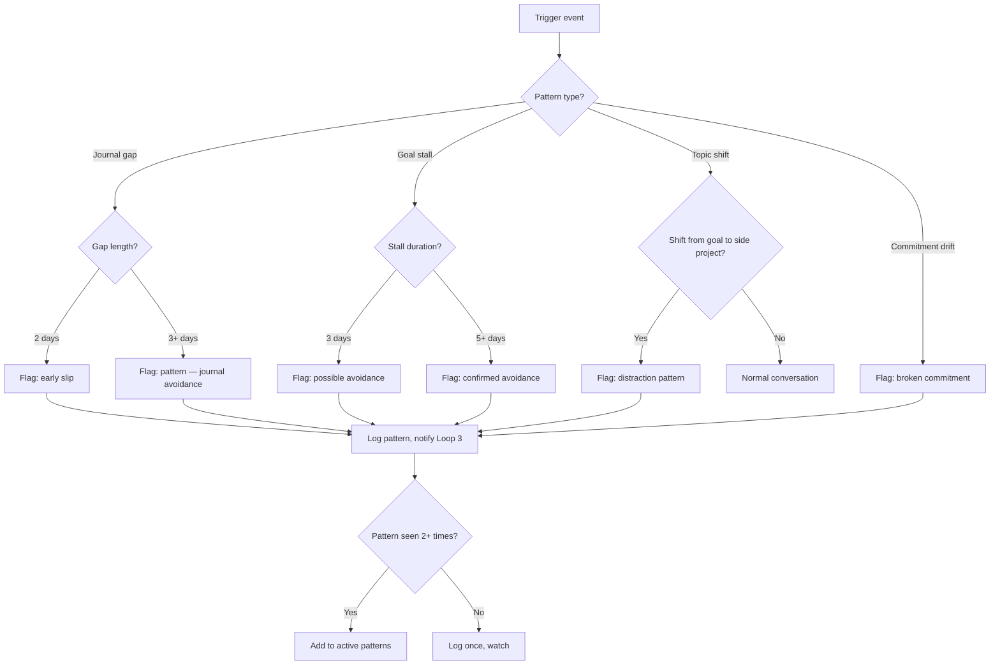

# Loop 4: Pattern Detection

## Purpose

Identify avoidance, burnout, distraction, and other behavioral patterns before they stall progress. Early detection enables intervention.

**The core problem this solves:** John's patterns repeat — distraction from main goal by side projects, journal gaps after commitment, weekend avoidance. Without detection, these patterns run unchecked until a deadline hits.

## Cadence

Continuous — triggered by events from other loops, not on a fixed schedule.

## Trigger events

| Event source | What triggers detection |
|---|---|
| Loop 1 | Journal gap ≥ 2 days |
| Loop 1 | End-of-day review empty for 5+ consecutive days |
| Loop 2 | Goal progress stalled for 3+ days |
| Loop 2 | Deadline within 7 days, progress < 30% |
| Conversation | Topic shifts > 3 in one session |
| Conversation | Commitment made but not referenced for 48h |

## Detection logic



## Known patterns (pre-loaded)

| Pattern | Detection criteria | Coaching response |
|---|---|---|
| Documentation-over-implementation | Writing docs/READMEs instead of building | Name it. "You're documenting again instead of building." |
| Distraction-by-side-project | Working on non-priority project while main goal stalls | "Wrong target." |
| Journal avoidance | Note gap after high engagement | "The silence is the signal." |
| Weekend collapse | Productive weekdays, zero weekend output | Adjust expectations for weekends |
| Burnout spiral | Declining energy + increasing avoidance + guilt | Switch to compassion. Stop pushing. |
| Commitment drift | Commitment made, not referenced, forgotten | "You said you'd do X. What happened?" |

## New pattern discovery

If the same trigger fires 3+ times in 2 weeks without matching a known pattern, it's a new pattern:
1. Log the trigger sequence
2. Ask John about it in the next live conversation
3. Name the pattern
4. Add to known patterns with detection criteria

## Output

Pattern flags are written to `coaching-state.json` patterns section. Loop 3 reads them to adjust strategy. Loop 6 reviews them weekly.

Does NOT send messages directly — pattern detection informs other loops.

## Handoffs

| Pattern | Target Loop | Action |
|---|---|---|
| Any pattern detected | Loop 3 | Adjust strategy category |
| Pattern confirmed (3+ detections) | Loop 6 | Review in weekly synthesis |
| Burnout detected | Loop 3 | Switch to compassion strategies immediately |
| Distraction detected | Loop 1 | Nudge about main goal |

## State Changes

```json
{
  "patterns": {
    "active": ["add new pattern if confirmed"],
    "lastDetected": "update date",
    "detectionCount": {"pattern-name": "increment"}
  }
}
```

## What this loop does NOT do

- Does not send messages (that's Loop 1)
- Does not choose strategies (that's Loop 3)
- Does not measure goal progress (that's Loop 2)
- Does not search knowledge base (that's Loop 5)
