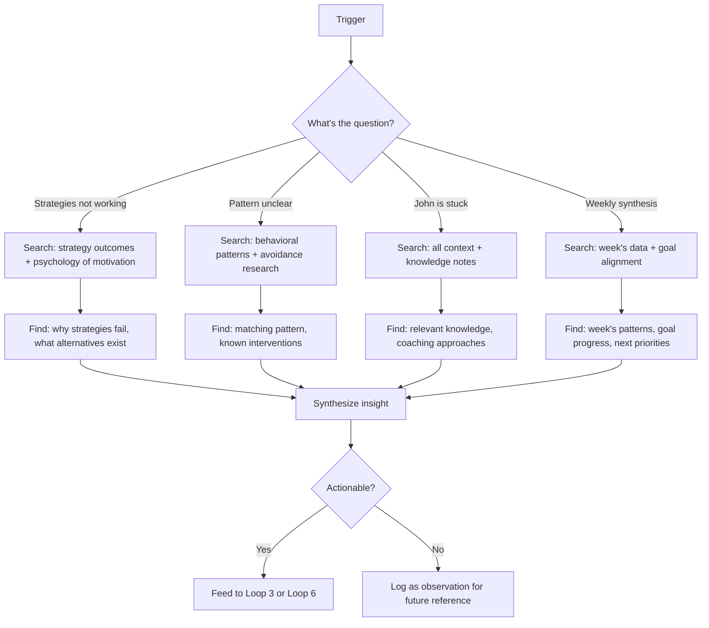

# Loop 5: Knowledge Application

## Purpose

Mine the knowledge base for coaching insights. When other loops hit a wall — strategies aren't working, patterns are unclear, John is stuck — this loop searches deeper.

**The core problem this solves:** The daily coaching loops work with limited context. When John is genuinely stuck, the daily loop can't help — it needs deeper analysis of what's going on psychologically, which strategies have scientific backing, and what patterns exist across weeks.

## Cadence

Weekly (part of Loop 6 synthesis) + on-demand when other loops signal "I'm stuck."

## Trigger events

| Event | Source |
|---|---|
| Weekly synthesis | Loop 6 |
| All strategies scoring low | Loop 3 |
| New pattern detected, no known response | Loop 4 |
| John asks a deep question in conversation | Live session |

## Inputs

| Source | What it reads |
|---|---|
| Vault-memory search | Knowledge/Psychology notes, coaching-learnings, Our Knowledge |
| `coaching-state.json` | Full state — all loops' data |
| Daily notes (past 7 days) | Mood, energy, completions, challenges |
| Strategy history | What worked, what didn't |

## Process

## Vault-memory queries

This is where the vector/graph DB actually matters. Queries are context-rich:

| Situation | Example query |
|---|---|
| Strategies failing | "avoidant procrastination motivation strategies what works" |
| Burnout detected | "ego depletion burnout recovery self-compassion" |
| John avoiding Dominius | "fear of success trauma avoidance work paralysis" |
| Journal gaps | "habit formation daily writing accountability" |
| Low mood streak | "depression motivation dopamine cognitive effort" |

The queries are constructed from the trigger context — not generic searches.

## Output

Insights are advisory — they feed into other loops:
- Strategy recommendations → Loop 3
- Pattern confirmations → Loop 4
- Goal alignment → Loop 6
- Direct insight → written to Aris Coaching/insights/ for live conversation context

Does NOT send messages to John. Does NOT make coaching decisions alone.

## Handoffs

| Output | Target Loop |
|---|---|
| New strategy recommendation | Loop 3 (add to rotation) |
| Pattern confirmed with intervention | Loop 4 (update known patterns) |
| Goal misalignment detected | Loop 6 (flag in weekly review) |
| Deep insight for John | Live conversation (reference in next chat) |

## State Changes

None directly. This loop is read-only on coaching-state.json. It writes to:
- `Aris Coaching/insights/` — insight notes for future reference
- Advises other loops which update coaching-state.json

## What this loop does NOT do

- Does not send messages (that's Loop 1)
- Does not make coaching decisions (that's Loop 3)
- Does not run daily (that's Loop 1 and 2)
- Does not measure progress (that's Loop 2)
