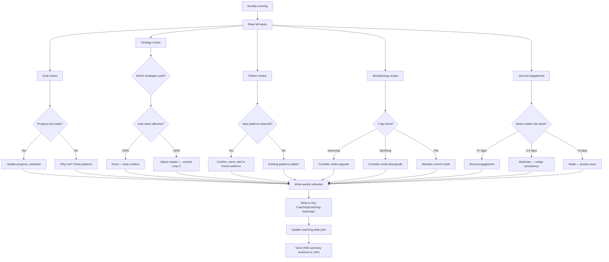

# Loop 6: Weekly Synthesis

## Purpose

Everything converges here. Weekly review of all loops' data, goal alignment check, strategy effectiveness review, pattern confirmation, and mode adjustment.

**The core problem this solves:** The daily loops are tactical — they handle today. The weekly synthesis is strategic — it asks "are we actually getting somewhere?" and adjusts the system if we're not.

## Cadence

Sunday evening (currently the `weekly-reflection` cron job).

## Inputs

Everything:

| Source | What it reads |
|---|---|
| `coaching-state.json` | Full state — all fields |
| Daily notes (past 7 days) | Mission, completions, mood, energy, challenges |
| `Aris Coaching/coaching-learnings/` | Previous weekly reflections |
| `Aris Coaching/patterns/` | Known patterns |
| Vault-memory search | Relevant knowledge notes, previous insights |
| MEMORY.md | Mode, commitments, strategy log |

## Process



## Weekly reflection output

Written to `Aris Coaching/coaching-learnings/YYYY-Www.md`:

```markdown
# Weekly reflection - W14 (April 1-6, 2026)

## Goals
- Dominius: 60% → 75% (+15%) ✓
- Tastrics: stalled at 0%

## Strategies used
- implementation-intentions: 3/4 effective
- humor-redirect: 2/3 effective
- direct-ask: 0/2 — avoid

## Patterns detected
- documentation-over-implementation: confirmed, 4th detection
- weekend-avoidance: new, first detection

## Mood/Energy
- Average mood: 6.2 (up from 5.8)
- Average energy: 5.5 (flat)
- Trend: mood improving, energy stable

## Mode
- Current: struggling
- Assessment: stable, no change

## Key insight
- John responds well to implementation intentions when the task is specific
- Generic "how's it going?" gets no response
- Dominius progress correlates with mood — when mood is up, work happens

## Next week focus
- Dominius layer 3 (deadline was March 31, now overdue)
- Tastrics outreach (zero progress for 2 weeks)
```

## Message to John

ONE sentence. Examples:
- "Week's done. Dominius moved from 60% to 75%. Tastrics stalled. What happened?"
- "Three good days this week. The pattern is clear — you work when you're in a good mood. How do we get more of those?"
- "Quiet week. Not bad, just quiet. What do you want to focus on next week?"

## Mode assessment

Based on the week's data:

| Condition | Mode change |
|---|---|
| 5+ notes, commitments kept, mood ≥ 7 | struggling → baseline |
| 3-4 notes, some progress, mood 5-6 | stay current |
| <3 notes, no progress, mood declining | baseline → struggling |
| 7+ notes, all commitments kept, energy high | baseline → momentum |
| 0 notes, no contact, 3+ days silence | any → returning |

Mode changes are gradual — never jump more than one level per week.

## Handoffs

| Output | Target |
|---|---|
| Strategy adjustment needed | Loop 3 (update rotation) |
| New pattern confirmed | Loop 4 (add to known patterns) |
| Knowledge gap found | Loop 5 (search next week) |
| Mode changed | coaching-state.json (update mode field) |
| Goal completed | coaching-state.json (archive goal, set new one) |

## State Changes

```json
{
  "mode": "updated if changed",
  "goals": [{
    "progress": "updated",
    "status": "updated if completed"
  }],
  "coaching": {
    "strategyHistory": "reviewed, old entries archived"
  },
  "patterns": {
    "active": "updated if new patterns confirmed"
  },
  "signals": {
    "avgMood7d": "recalculated",
    "avgEnergy7d": "recalculated"
  }
}
```

## What this loop does NOT do

- Does not send daily messages (that's Loop 1)
- Does not make real-time coaching decisions (that's Loop 3)
- Does not detect patterns in real-time (that's Loop 4)
